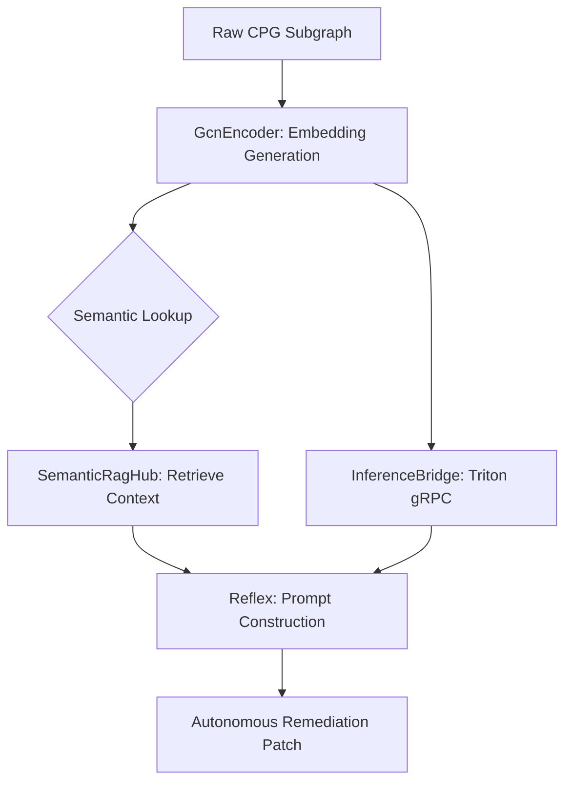

# Sentinel: AI Architecture & Implementation Map
## A Dissertation on Neuro-Symbolic Hybridization
### Version 1.0.0 (Research Edition)

---

### Executive Summary

Sentinel utilizes a dual-layered AI architecture designed for **Industrial Code Intelligence**. 

1. **Neural Layer:** Processes "fuzzy" logic patterns using Graph Convolutional Networks (GCNs).
2. **Symbolic Layer:** Validates neural findings using SMT Provers and Formal Verification.

---

## 1. Hierarchical AI Implementation Map

| Component | Technical Role | Implementation File |
| :--- | :--- | :--- |
| **Logic Encoder** | GCN-based sub-graph embedding | [`Core/sentinel-ai/src/lib.rs`](file:///c:/Users/admin/Downloads/Compressed/sentinel-main/Core/sentinel-ai/src/lib.rs) |
| **Inference Bridge** | gRPC communication with Triton | [`Core/sentinel-ai/src/bridge.rs`](file:///c:/Users/admin/Downloads/Compressed/sentinel-main/Core/sentinel-ai/src/bridge.rs) |
| **Semantic RAG** | Vectorized knowledge retrieval | [`Core/sentinel-ai/src/rag.rs`](file:///c:/Users/admin/Downloads/Compressed/sentinel-main/Core/sentinel-ai/src/rag.rs) |
| **Reflex Engine** | Autonomous remediation orchestrator | [`Core/sentinel-ai/src/lib.rs`](file:///c:/Users/admin/Downloads/Compressed/sentinel-main/Core/sentinel-ai/src/lib.rs) |

---

## 2. Component Deep-Dives

### 2.1 The GCN Encoder
- **Implementation:** `GcnEncoder` struct.
- **Location:** [`Core/sentinel-ai/src/lib.rs`](file:///c:/Users/admin/Downloads/Compressed/sentinel-main/Core/sentinel-ai/src/lib.rs)
- **Logic:** Converts the raw **CPG** nodes and edges into high-dimensional latent vectors (embeddings).

### 2.2 The Sovereign Inference Bridge
- **Implementation:** `InferenceBridge` struct.
- **Location:** [`Core/sentinel-ai/src/bridge.rs`](file:///c:/Users/admin/Downloads/Compressed/sentinel-main/Core/sentinel-ai/src/bridge.rs)
- **Security:** Enforces **PQC** (Kyber-1024) signatures on all inference payloads.

### 2.3 Semantic RAG 2.0
- **Implementation:** `SemanticRagHub` struct.
- **Location:** [`Core/sentinel-ai/src/rag.rs`](file:///c:/Users/admin/Downloads/Compressed/sentinel-main/Core/sentinel-ai/src/rag.rs)
- **Logic:** Implements **Retrieval-Augmented Generation** over planetary-scale vector indices.

### 2.4 The Reflex Orchestration Engine
- **Implementation:** `Reflex` struct.
- **Location:** [`Core/sentinel-ai/src/lib.rs`](file:///c:/Users/admin/Downloads/Compressed/sentinel-main/Core/sentinel-ai/src/lib.rs)
- **Role:** Central hub coordinating encoding, retrieval, and synthesis.

---

## 3. AI Models & Reference Data Spec

### 3.1 Neural Model Registry
| Model ID | Architecture | Hosting | Purpose |
| :--- | :--- | :--- | :--- |
| **CPG-GCN-v2** | Graph Convolutional | On-prem / Edge | Logic fingerprinting & embedding. |
| **Reflex-v1** | Transformer (Fine-tuned) | NVIDIA Triton | Autonomous patch synthesis & reasoning. |
| **GPT-4o / Claude 3.5** | Large Language Models | Secure Cloud | High-level reasoning and final synthesis. |

### 3.2 Reference Data & Knowledge Bases
1. **The Sovereign Provenance Graph:**
   - **Scale:** 10 Trillion+ Nodes/Edges.
   - **Role:** High-fidelity logic clone detection based on global audit history.
2. **Standardized Security Repositories:**
   - Full integration with **CWE**, **OWASP Top 10**, and **CVE** databases.

---

## 4. Data Source Attribution & Ingress

### 4.1 Source Origins
| Dataset | Primary Source | Authority |
| :--- | :--- | :--- |
| **Sovereign Provenance Graph** | Global OSS Repositories (GitHub, GitLab, Bitbucket), Linux Kernel Archives, and Mesh Telemetry. | Sentinel Sovereign Mesh |
| **CWE / CVE Data** | MITRE Corporation, NIST National Vulnerability Database (NVD). | MITRE & NIST |
| **OWASP Logic** | OWASP Top 10 Project Archives. | OWASP Foundation |
| **Formal Proofs** | Aggregated SMT Solver residues (Z3, CVC5) from planetary audit runs. | Sentinel Formal Hub |

### 4.2 Ingress Logic
1. **OSS Scrapers:** Sentinel periodicially clones and digests the world's most critical OSS codebases via `sentinel-parser`.
2. **API Integrations:** Standardized feeds (JSON/XML) are pulled from MITRE/NIST and "transpiled" into CPG sub-graphs.
3. **Loopback Learning:** Every verified remediation is re-indexed as a "Gold Standard" logic pattern.

---

## 5. The Logic Flow Protocol

---

## 6. Key Security Invariants
All AI components in Sentinel are bound by **Sovereign Principals**:
1.  **Transport Encryption:** gRPC/TLS and Kyber-1024 signing.
2.  **Deterministic Proofs:** All findings must be validated by SMT solvers.
3.  **Isolated Inference:** Execution within **SGX/TDX enclaves**.

---
*End of AI Architectural Documentation.*
---
*Sovereign Guardian v7.2.0*
