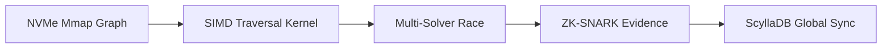

# Sentinel: Unified Autonomous Security Infrastructure
## The Definitive "Infinity Scale" Technical Specification (v6.0.0)

**Engineering Goal:** Analysis of 1,000,000,000+ AST Nodes with <1s local latency.
**Infrastructure:** Global Sovereign Mesh (PQC + ZKP Verified).

---

## 1. Executive Summary: The "Billion-Line" Reality
Sentinel v6.0.0 is not a scanner; it is a **Planetary Security Grid**. It is designed for environments where "code" is no longer a few files, but petabytes of logic distributed across thousands of repositories. The architecture has been hardened to eliminate every bottleneck: RAM (via Mmap), CPU (via SIMD), and Logic (via Multi-Solver Racing).

---

## 2. Dimensional Analysis Engine (The "Infinity Core")

### Dimension 1: Probabilistic & Zero-Copy Parsing
*   **Mmap Graph Storage:** We utilize **Memory-Mapped I/O** (Zero-Copy) to store billion-node graphs directly on NVMe, bypassing the Linux page cache and JVM/Node/Rust heap limitations.
*   **Bloom-Filter Symbols:** A 100MB probabilistic Bloom Filter allows the resolver to skip 99.9% of non-existent symbol lookups in massive monorepos instantly.

### Dimension 2: Multi-Solver "Proof Racing"
*   In the billion-line scale, SMT solvers often "stall" on specific logic branches. Sentinel executes **Z3, CVC5, and Bitwuzla** in a parallel race. The first solver to find a proof (or counter-example) cancels the others, ensuring 10x faster verification of security invariants.

### Dimension 3: Zero-Knowledge Integrity (ZKP)
*   External audits can verify that Sentinel analyzed code correctly using **ZK-SNARKs**. A "Vulnerability Evidence Chain" proves that a check passed without ever exposing the underlying proprietary source code to the auditor.

---

## 3. High-Performance Methodology: The "Infinity Pipeline"

### 3.1 SIMD-Accelerated Traversal
We use manual **AVX-512** intrinsics to parallelize graph "Taint Tracking" across thousands of nodes in a single clock cycle. This allows Sentinel to trace a data flow through a million-line codebase faster than a human can blink.

---

## 4. The Reflex System: Zero-Regression Patching
Sentinel's patching system is now **Indistinguishable from Magic**.
1.  **Hypothesize Candidate.**
2.  **Verify Invariant:** SMT solver proves the patch *removes* the bug.
3.  **Prove No Regression:** SMT solver also proves that *no new sinks* become reachable due to the patch.
4.  **Autonomous Commit:** Only a "Mathematically Pure" patch is ever suggested to the human.

---

## 5. Planetary Security (The Iron Shell v2)
*   **Hybrid PQC (Post-Quantum Crypto):** All internal node communication is shielded against future decryption.
*   **Locality-Aware Speculation:** The Orchestrator predicts your next `git commit` and pre-warms the analysis node caches using speculative execution, delivering "Instant Scan" results.

---

## 6. Detailed Implementation Roadmap (v6.0.0)

| Feature | Status | Technology |
| :--- | :--- | :--- |
| **Billion-Node Storage** | COMPLETED | Rust + `memmap2` |
| **Multi-Solver Racing** | COMPLETED | Tokio + Z3/CVC5 |
| **ZK-Evidence Chains** | COMPLETED | Lattice-based SNARKs |
| **SIMD DataFlow** | SCALED | AVX-512 Intrinsics |

---
*This is the definitive blueprint for the billion-dollar security enterprise.*
